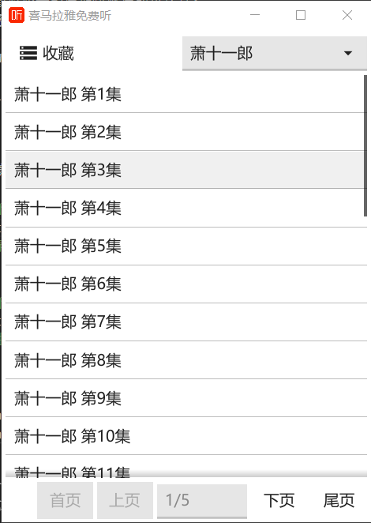

# 喜马拉雅免费听 Fyne GUI
[喜马拉雅免费听](https://github.com/funte/xmlymft) 的 GUI.  

🍌下载对应平台压缩包解压  
| 系统 | 下载地址 |
| -- | --- |
| Widnows | [喜马拉雅免费听_win32.zip]() |  
| | [喜马拉雅免费听_win64.zip]() |  
| Linux | [喜马拉雅免费听_linux32.tar.gz](TODO:) |  
| | [喜马拉雅免费听_linux64.tar.gz](TODO:) |  


🍌输入关键词并回车开始搜索专辑, 点击专辑进入播放列表, 点击音频自动下载音频  
  

## 构建
环境要求 `go-1.17, fyne-cross, docker`.  
```sh
# 下载安装 fyne-cross
git clone https://github.com/fyne-io/fyne-cross.git && cd fyne-cross && go install

# 下载本项目代码
git clone https://github.com/xmlymft-fyne-gui.git && cd xmlymft-fyne-gui
git pull --recurse-submodules
# 生成 windows 程序
# !!请将命令中的环境变量 <proxy>:<port> 替换为有效的代理地址, 否则 go 可能无法下载依赖
# !!如果命令 "-H=windowsgui" 失效, 请将 7567bc0a81f9e2f1bc441647ae59415a01e61389 手动合并到你本地 fyne-cross 代码中, 并重新编译安装 fyne-cross
# !!如果 docker 拉取镜像速度太慢, 可以设置镜像代理加速, 参考 https://yeasy.gitbook.io/docker_practice/install/mirror
fyne-cross windows -arch="amd64,386" -output="xmlymft.exe" -env="https_proxy=<ip>:<port>" -ldflags="-H=windowsgui"
# 生成 linux 程序
fyne-cross linux -arch="amd64,386" -output="xmlymft" -env="https_proxy=<ip>:<port>"

# 生成打包文件
# 如果一切顺利, 最后生成的打包文件位于 `./release` 目录下, 解压即可使用
go run ./scripts/release.go
```
